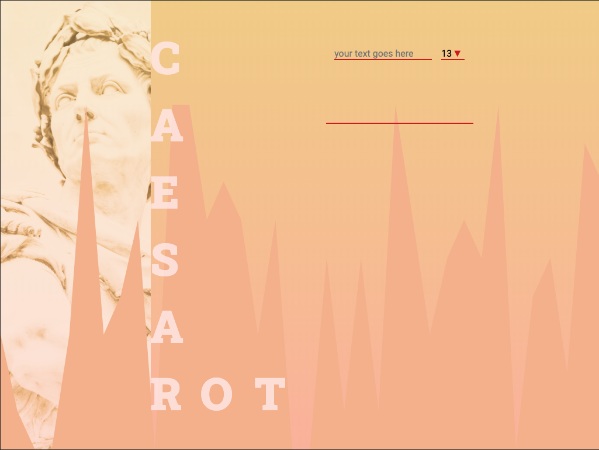

# Caesar cipher ROT13

In cryptography, a Caesar cipher, also known as Caesar's cipher, the shift cipher, Caesar's code or Caesar shift, is one of the simplest and most widely known encryption techniques. It is a type of substitution cipher in which each letter in the plaintext is replaced by a letter some fixed number of positions down the alphabet. For example, with a left shift of 3, D would be replaced by A, E would become B, and so on. The method is named after Julius Caesar, who used it in his private correspondence.
_[Wikipedia](https://en.wikipedia.org/wiki/Caesar_cipher)_

## Website 🚀

[go to the website](https://rogreyroom.github.io/caesar-rot/)



## What is it

Project to practice typescript and jest.

The app is taking two inputs. One is a string that you want to encode and the second is the rot number. Rot is a number that shifts every letter of the string forward. The numbers and the special characters are not movable.
The output of the app is a encoded string with the given ROT value.

### Run it

* tests
```npm run test or yarn test```

* dev
```npm run start or yarn start```

* build
```npm run build or yarn build```

* deploy
```npm run deploy or yarn deploy```

## Installation

    ```
        npm i or yarn
    ```

## Build with

* [parcel](https://parceljs.org/)
* [typescript](https://typescriptlang.org)
* [jest](https://jestjs.io/)

## Version

v.1.0.0

## Author

Robert Adamczewski

## License

This project is licensed under MIT License - see the [LICENSE.md](./LICENSE) file for details.
